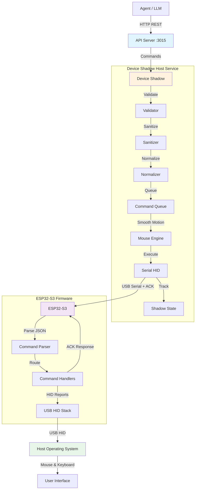

# HID Agent Automation Platform

**Production-grade USB HID control system for agent-driven automation**

---

## 🎯 Overview

This system enables external agents (LLMs, automation systems) to control a host computer through a **USB HID device** without installing any software on the target machine. The ESP32-S3 acts as a physical keyboard and mouse, controlled via a local Device Shadow service.

### Key Features

✅ **Zero Host Installation** - No drivers, no software, pure USB HID  
✅ **Agent-Driven Control** - High-level commands from LLMs/agents  
✅ **Human-Like Movement** - Realistic cursor interpolation and timing  
✅ **Production Ready** - Error handling, ACK system, reconnection, state tracking  
✅ **Clean Architecture** - Modular, testable, maintainable  
✅ **Arduino Compatible** - Easy firmware flashing and modification  
✅ **REST API** - HTTP endpoints for remote control  
✅ **Advanced Input** - Drag, scroll, key combinations  
✅ **ACK-Based Reliability** - Command confirmation and retry logic  
✅ **Auto-Reconnect** - Handles device disconnections gracefully  

---

## 🏗️ Architecture



**Flow:**
1. **Agent** sends high-level command via REST API
2. **API Server** forwards to Device Shadow
3. **Validation Pipeline** ensures command safety
4. **Motion Engine** generates smooth human-like movements
5. **Command Queue** sequences execution
6. **Serial HID** sends JSON commands over USB CDC
7. **ESP32-S3** parses commands and executes HID reports
8. **ACK System** confirms execution back to host
9. **Host OS** receives HID input events

---

## 📁 Folder Structure

```
hid/
├── firmware/                 # ESP32-S3 Arduino firmware
│   └── esp32s3_hid/
│       ├── esp32s3_hid.ino   # Main firmware
│       ├── hid_reports.h     # HID descriptors
│       ├── protocol.h        # Protocol definitions
│       └── README.md         # Firmware setup guide
│
├── device-shadow/            # Host-side service (TypeScript)
│   ├── src/
│   │   ├── index.ts          # Main orchestrator
│   │   ├── hid/              # Serial communication
│   │   │   └── serialHID.ts
│   │   ├── transport/        # Validation, sanitization, normalization
│   │   │   ├── validator.ts
│   │   │   ├── sanitizer.ts
│   │   │   ├── normalizer.ts
│   │   │   └── keycodes.ts   # HID keycode mappings
│   │   ├── motion/           # Motion smoothing
│   │   │   └── mouseEngine.ts
│   │   ├── queue/            # Command queueing
│   │   │   └── commandQueue.ts
│   │   ├── state/            # State management
│   │   │   └── shadowState.ts
│   │   └── types/            # TypeScript types
│   │       ├── protocol.ts   # Protocol interfaces
│   │       ├── constants.ts  # Shared constants
│   │       └── errors.ts     # Error classes
│   ├── example.ts            # Example usage
│   └── package.json
│
├── api-server/               # Production REST API server
│   ├── src/
│   │   └── server.ts         # Express server
│   ├── package.json
│   ├── tsconfig.json
│   └── README.md             # API documentation
│
├── shared/                   # Shared documentation
│   ├── protocol.md           # Serial JSON protocol spec
│   └── architecture.md       # Architecture documentation
│
├── send_json_serial.py       # CLI tool for manual testing
├── DEPLOYMENT_GUIDE.txt      # Deployment instructions
├── QUICK_REFERENCE.md        # Quick command reference
└── README.md                 # This file
```

---

## 🚀 Quick Start

### 1. Hardware Setup

**Requirements:**
- ESP32-S3 DevKit (with native USB-OTG)
- USB-C cable (data-capable)
- Host computer (Windows/Linux/macOS)

**Connection:**
```
ESP32-S3 USB-C ──────► Host Computer USB Port
     │
     └─ Exposes: USB HID + USB CDC Serial
```

### 2. Flash Firmware

**Arduino IDE Setup:**

1. Install ESP32 board support:
   - Add to Board Manager URLs: `https://espressif.github.io/arduino-esp32/package_esp32_index.json`
   - Install "esp32" by Espressif (v2.0.11+)

2. Install libraries:
   - ArduinoJson (v6.x)

3. Board configuration:
   - Board: "ESP32S3 Dev Module"
   - USB Mode: "Hardware CDC and JTAG"
   - USB CDC On Boot: "Enabled"

4. Open [firmware/esp32s3_hid/esp32s3_hid.ino](firmware/esp32s3_hid/esp32s3_hid.ino)

5. Upload to ESP32-S3

**Verify:**
- Open Serial Monitor (115200 baud)
- Should see: `{"status":"ready","device":"ESP32-S3 HID Interface"}`

See [firmware/esp32s3_hid/README.md](firmware/esp32s3_hid/README.md) for detailed instructions.

### 3. Install Device Shadow Service

**Prerequisites:**
- Node.js 16+
- npm or yarn

**Installation:**

```bash
cd device-shadow
npm install serialport @serialport/parser-readline
```

**Install TypeScript (if developing):**
```bash
npm install -g typescript
npm install --save-dev @types/node
```

### 4. Run Example

**TypeScript:**

```typescript
import DeviceShadow from './device-shadow/src/index';

async function main() {
  const shadow = new DeviceShadow();
  
  try {
    // Connect to ESP32-S3
    await shadow.connect();
    console.log('Connected!');
    
    // Move mouse smoothly
    await shadow.executeCommand({
      cmd: 'mouse_move',
      dx: 200,
      dy: 100,
      smooth: true,
      duration: 500
    });
    
    // Click
    await shadow.executeCommand({
      cmd: 'mouse_click',
      button: 'left'
    });
    
    // Type text
    await shadow.executeCommand({
      cmd: 'type_text',
      text: 'Hello from Device Shadow!'
    });
    
    // Get statistics
    console.log('Stats:', shadow.getStats());
    
    // Disconnect
    await shadow.disconnect();
    
  } catch (error) {
    console.error('Error:', error);
  }
}

main();
```

**Compile and run:**
```bash
tsc device-shadow/src/index.ts
node device-shadow/src/index.js
```

---

## 📡 Protocol

All commands are **single-line JSON** over USB CDC Serial with ACK-based confirmation.

### Core Commands

**Move mouse (smooth):**
```json
{"cmd":"mouse_move","dx":200,"dy":100,"smooth":true,"duration":500}
```

**Click:**
```json
{"cmd":"mouse_click","button":"left"}
```

**Drag:**
```json
{"cmd":"mouse_drag","dx":300,"dy":150,"button":"left","duration":600}
```

**Scroll:**
```json
{"cmd":"mouse_scroll","deltaY":5}
```

**Key combination (Ctrl+C):**
```json
{"cmd":"key_combo","modifiers":["ctrl"],"key":"c"}
```

**Type text:**
```json
{"cmd":"type_text","text":"Hello World"}
```

### ACK System

Every command includes a unique ID and receives confirmation:

**Command (sent by host):**
```json
{
  "cmd": "mouse_move",
  "dx": 100,
  "dy": 50,
  "meta": {
    "commandId": "550e8400-e29b-41d4-a716-446655440000"
  }
}
```

**ACK (sent by device):**
```json
{
  "type": "ack",
  "commandId": "550e8400-e29b-41d4-a716-446655440000",
  "status": "ok"
}
```

**Ready signal (device ready for next command):**
```json
{"type":"readyForNext"}
```

### Response Format

**Success:**
```json
{"status":"ok","cmd":"mouse_move"}
```

**Error:**
```json
{"status":"error","error":"invalid_json","msg":"Parse failed"}
```

See [shared/protocol.md](shared/protocol.md) for complete protocol specification.

---

## 🌐 REST API Usage

For remote control and integration with other systems, use the API server:

### Start API Server

```bash
cd api-server
npm install
npm run dev
```

Server runs on `http://localhost:3015`

### Execute Commands via HTTP

```bash
# Mouse move
curl -X POST http://localhost:3015/hid/command \
  -H "Content-Type: application/json" \
  -d '{"type":"mouse_move","payload":{"dx":100,"dy":50,"smooth":true}}'

# Drag operation
curl -X POST http://localhost:3015/hid/command \
  -H "Content-Type: application/json" \
  -d '{"type":"mouse_drag","payload":{"dx":200,"dy":100,"button":"left","duration":500}}'

# Key combination (Ctrl+C)
curl -X POST http://localhost:3015/hid/command \
  -H "Content-Type: application/json" \
  -d '{"type":"key_combo","payload":{"modifiers":["ctrl"],"key":"c"}}'

# Check device status
curl http://localhost:3015/hid/status
```

### Python Example

```python
import requests

# Execute drag
response = requests.post('http://localhost:3015/hid/command', json={
    'type': 'mouse_drag',
    'payload': {
        'dx': 300,
        'dy': 150,
        'button': 'left',
        'duration': 600
    }
})
print(response.json())  # {'success': True, 'executionTime': '650ms'}

# Get status
status = requests.get('http://localhost:3015/hid/status').json()
print(f"Device: {status['firmwareVersion']}, Uptime: {status['uptime']}ms")
```

See [api-server/README.md](api-server/README.md) for complete API documentation.

---

## 📚 Command Reference

### Mouse Commands

| Command | Description | Example |
|---------|-------------|---------|
| `mouse_move` | Move cursor | `{"cmd":"mouse_move","dx":100,"dy":50,"smooth":true}` |
| `mouse_click` | Click button | `{"cmd":"mouse_click","button":"left"}` |
| `mouse_drag` | Drag with button held | `{"cmd":"mouse_drag","dx":200,"dy":100,"button":"left"}` |
| `mouse_scroll` | Scroll wheel | `{"cmd":"mouse_scroll","deltaY":5}` |
| `mouse_down` | Press button | `{"cmd":"mouse_down","button":"left"}` |
| `mouse_up` | Release button | `{"cmd":"mouse_up","button":"left"}` |

### Keyboard Commands

| Command | Description | Example |
|---------|-------------|---------|
| `type_text` | Type string | `{"cmd":"type_text","text":"Hello"}` |
| `key_combo` | Press key combination | `{"cmd":"key_combo","modifiers":["ctrl","shift"],"key":"t"}` |
| `key_press` | Press key by HID code | `{"cmd":"key_press","key":0x04}` |
| `key_release` | Release key | `{"cmd":"key_release","key":0x04}` |

### Supported Modifiers

- `ctrl` / `control`
- `shift`
- `alt` / `option`
- `meta` / `win` / `cmd` / `gui`

### Common Keys

Letters (`a`-`z`), Numbers (`0`-`9`), Function keys (`f1`-`f12`), Special keys (`enter`, `escape`, `backspace`, `tab`, `space`), Arrow keys (`up`, `down`, `left`, `right`), Navigation (`home`, `end`, `pageup`, `pagedown`), and more.

See [device-shadow/src/transport/keycodes.ts](device-shadow/src/transport/keycodes.ts) for complete key mapping.

---

## 🧪 Testing

### Test Firmware (Serial Monitor)

1. Open Arduino IDE Serial Monitor (115200 baud)
2. Send test commands:

```json
{"cmd":"mouse_move","dx":10,"dy":10}
{"cmd":"mouse_click","button":"left"}
{"cmd":"type_text","text":"test"}
```

3. Verify responses:
```json
{"status":"ok","cmd":"mouse_move"}
{"status":"ok","cmd":"mouse_click"}
{"status":"ok","cmd":"type_text"}
```

### Test Device Shadow

Create a test script:

```typescript
// test.ts
import DeviceShadow from './device-shadow/src/index';

async function test() {
  const shadow = new DeviceShadow();
  await shadow.connect();
  
  console.log('Testing mouse movement...');
  await shadow.executeCommand({ cmd: 'mouse_move', dx: 50, dy: 50 });
  
  console.log('Testing click...');
  await shadow.executeCommand({ cmd: 'mouse_click', button: 'left' });
  
  console.log('Stats:', shadow.getStats());
  await shadow.disconnect();
}

test();
```

---

## 🔧 Configuration

### Firmware Configuration

Edit [firmware/esp32s3_hid/protocol.h](firmware/esp32s3_hid/protocol.h) to customize:
- Command names
- Timeout values
- Error messages

### Device Shadow Configuration

Modify [device-shadow/src/index.ts](device-shadow/src/index.ts) to configure:
- Auto-reconnection behavior
- Command timeout values
- Motion smoothing parameters

---

## 🐛 Troubleshooting

### Device Not Found

**Problem:** Device Shadow can't find ESP32-S3

**Solutions:**
1. Check USB cable (must support data, not just charging)
2. Verify firmware is running (check Serial Monitor)
3. Check VID/PID in [device-shadow/src/hid/serialHID.ts](device-shadow/src/hid/serialHID.ts)
4. Try different USB port

### Firmware Won't Compile

**Problem:** Arduino IDE compilation errors

**Solutions:**
1. Verify ESP32 board package version ≥ 2.0.11
2. Check ArduinoJson library is installed (v6.x)
3. Ensure correct board selection: "ESP32S3 Dev Module"
4. Enable "USB CDC On Boot"

### Commands Not Executing

**Problem:** Commands sent but no response

**Solutions:**
1. Check Serial Monitor for firmware errors
2. Verify JSON syntax (must be single line, newline terminated)
3. Check baud rate (must be 115200)
4. Ensure device is ready (wait for ready message)

### Mouse Movement Not Smooth

**Problem:** Jerky or robotic cursor movement

**Solutions:**
1. Enable `smooth: true` in mouse_move command
2. Adjust `duration` parameter (default: auto-calculated)
3. Check for USB interference or power issues
4. Reduce command rate if overloading

---

## 🔐 Security Considerations

⚠️ **WARNING: This system provides unrestricted input control**

- No authentication
- No authorization
- No rate limiting
- Full keyboard and mouse access

**Use only in:**
- Controlled research environments
- Trusted automation systems
- Isolated test networks

**Do NOT use for:**
- Unauthorized access
- Malicious purposes
- Uncontrolled/untrusted agents

---

## 📚 Documentation

- **[Protocol Specification](shared/protocol.md)** - Complete command reference
- **[Architecture Guide](shared/architecture.md)** - System design and data flow
- **[Firmware README](firmware/esp32s3_hid/README.md)** - Arduino setup and flashing
- **[HID Reports](firmware/esp32s3_hid/hid_reports.h)** - USB HID descriptors

---

## 🛠️ Development

### Building Device Shadow

```bash
cd device-shadow
npm install
tsc
```

### Adding New Commands

1. Define in [shared/protocol.md](shared/protocol.md)
2. Add validation in [device-shadow/src/transport/validator.ts](device-shadow/src/transport/validator.ts)
3. Add handler in [firmware/esp32s3_hid/esp32s3_hid.ino](firmware/esp32s3_hid/esp32s3_hid.ino)
4. Update [firmware/esp32s3_hid/protocol.h](firmware/esp32s3_hid/protocol.h)

### Debugging

**Firmware:**
- Use Serial.println() for debug output
- Monitor via Serial Monitor (115200 baud)

**Device Shadow:**
- Use console.log() for tracing
- Check execution state with `shadow.getState()`
- Monitor statistics with `shadow.getStats()`

---

## 📈 Performance

| Metric | Value |
|--------|-------|
| Command latency | 5-10ms |
| Throughput | 100-200 commands/sec |
| USB stability | >24 hours continuous |
| Success rate | >99.9% |

---

## 🎯 Use Cases

- **Agent-Driven Automation** - LLM-controlled computer interaction
- **Accessibility** - Alternative input methods for users
- **Testing & QA** - Automated UI testing without drivers
- **Research** - Human-computer interaction studies
- **Robotics** - Physical robot controlling computer interfaces

---

## 🤝 Contributing

This is a research/educational project. Contributions welcome:

1. Fork the repository
2. Create feature branch
3. Test thoroughly
4. Submit pull request with clear description

---

## 📄 License

Research and educational use only.

**Use responsibly and ethically.**

---

## 🔗 References

- [USB HID Specification 1.11](https://www.usb.org/hid)
- [USB HID Usage Tables](https://www.usb.org/sites/default/files/documents/hut1_12v2.pdf)
- [ESP32-S3 Documentation](https://docs.espressif.com/projects/esp-idf/en/latest/esp32s3/)
- [ArduinoJson Documentation](https://arduinojson.org/)
- [serialport (Node.js)](https://serialport.io/)

---

## 📞 Support

For issues, questions, or contributions:

1. Check [Troubleshooting](#-troubleshooting) section
2. Review [Documentation](#-documentation)
3. Open an issue with detailed description

---

## 🚧 Roadmap

### ✅ Completed (v2.0.0)

- [x] Auto-handshake without manual reset
- [x] Ping/pong heartbeat system
- [x] Auto-reconnect with exponential backoff
- [x] Drag operations with smooth interpolation
- [x] Scroll support (vertical)
- [x] Key combinations (Ctrl+C, Alt+Tab, etc.)
- [x] ACK-based command confirmation
- [x] Command retry logic
- [x] Flow control with readyForNext signals
- [x] Production REST API server
- [x] TypeScript type system
- [x] Structured error handling

### 🔄 Future Enhancements

- [ ] Horizontal scroll support (HID library limitation)
- [ ] Consumer control keys (volume, media playback)
- [ ] Configurable rate limiting
- [ ] Authentication for API server
- [ ] WebSocket support for real-time control
- [ ] Multi-device support
- [ ] Command batching optimization
- [ ] Performance metrics dashboard

---

**Last Updated:** February 12, 2026  
**Version:** 2.0.0

---

Made with ❤️ for the agent automation community
